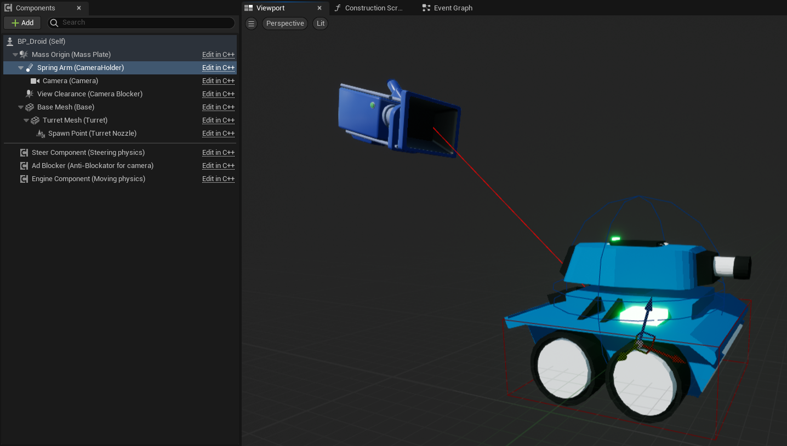
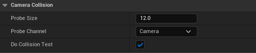
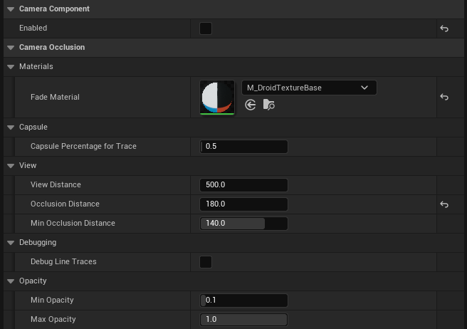
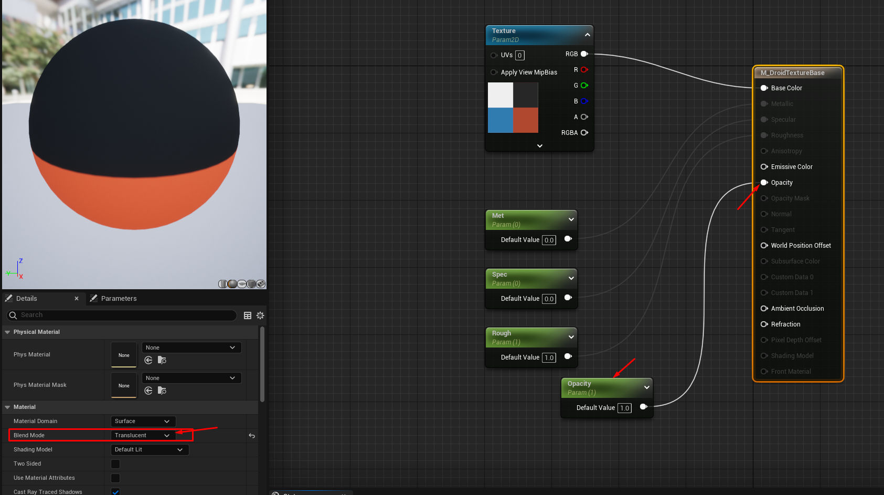

# Camera anti-block component

This is a brief manual for the anti-block component.

## What is anti-blocking?

Basically spring arm for camera have collision test feature, that protects camera from clipping thru walls.
But even this feature didn't save player from camera clipping thru pawn meshes. Like it happens in the
3rd person arrangement: camera look into the pawn back.

Basic pawn structure:\

_We see spring arm that will adjust when camera will hit wall_

\
_Enable 'DoCollisionTest' to apply_

That is how it looks in the game, but also how looks camera thru pawn clipping:\


## What we want to achive?

It would help if we could make pawn meshes transparent instead of clipping thru them.

## How component is architectured?

The main fields are for storing data about meshes that we need to modify:

```cpp
// CameraAdBlockerComponent.h
...
USTRUCT(BlueprintType)
struct FCameraBlocker
{
	GENERATED_USTRUCT_BODY()

	UPROPERTY(VisibleAnywhere, BlueprintReadOnly)
	UStaticMeshComponent* StaticMesh;

	UPROPERTY(VisibleAnywhere, BlueprintReadOnly)
	TArray<UMaterialInterface*> Materials;

	UPROPERTY(VisibleAnywhere, BlueprintReadOnly)
	bool bToModify;
};
...
```

_This struct will help us to define what should we do with some mesh (bToModify - 'true' to make transparent, 'false' to return original material); and we also whant to save original materials somewhere._

```cpp
// CameraAdBlockerComponent.h
...
private:
	//@ Utilities

	//? Container for current trackable meshes
	TMap<const UStaticMeshComponent*, FCameraBlocker> BlockingMeshes;
...
```

_In the Utitlities declarations we can find BlockingMeshes map in which we will store meshes that we would find (also they materials and will keep track what we do with mesh in the bToModify variable)._

Core function is CheckOccludedMeshes() - it called every tick. It will do all the job.
We only prevent to call it if there is no Target SceneComponent, Capsule and Camera parsed to the CameraAdBlockComponent and also if we whant to use component ('Enabled' have to be true).

```cpp
// CameraAdBlockerComponent.h
...
private:
	//@ Methods

	//? Maybe some new meshes need to modify or rollback already modified
	void CheckOccludedMeshes();
...

// CameraAdBlockerComponent.cpp
...
void UCameraAdBlockerComponent::Launch(USceneComponent* Target, UCapsuleComponent* Capsule, UCameraComponent* Camera)
{
	ViewTarget = Target;
	ViewClearance = Capsule;
	ViewCamera = Camera;

	//? If all of them valid we can tick
	if (ViewTarget && ViewClearance && ViewCamera)
	{
		bInit = true;
	}
}
...
```

To use component we need to declare, define/initialize it and **ALSO** parse some valueable parts:

```cpp
// DroidPawnBase.h
...
protected:
	//@ AdBlocker

	//?
	UPROPERTY(EditDefaultsOnly, Category = "Anti blocking feature")
	class UCameraAdBlockerComponent* AdBlocker{ nullptr };
...

// DroidPawnBase.cpp
...

ADroidPawnBase::ADroidPawnBase()
{
...
	AdBlocker = CreateDefaultSubobject<UCameraAdBlockerComponent>(TEXT("Anti-Blockator for camera"));
...
}

...
void ADroidPawnBase::BeginPlay()
{
	Super::BeginPlay();

	//? Make camera anti blockator available
	AdBlocker->Launch(SpawnPoint, ViewClearance, Camera);
}
...
```

Later we will use 'SpawnPoint' pointer as Target in which way we look, 'ViewClearance' as sweep capsule to define all meshes that block camera, and obviously we need to know what camera exactly woudld be tracked.

So to check all meshes we use Tracing from UKismetSystemLibrary:

```cpp
// CameraAdBlockerComponent.cpp

...
//? Call check if it's initialized and enabled
void UCameraAdBlockerComponent::TickComponent(float DeltaTime, ELevelTick TickType,
											  FActorComponentTickFunction* ThisTickFunction)
{
	Super::TickComponent(DeltaTime, TickType, ThisTickFunction);

	//? Check maybe should make transparent something
	if (bInit && Enabled) CheckOccludedMeshes();
}
...
```

Here you got Enabled field:

```cpp
// CameraAdBlockerComponent.h
...
public:

	//@ Properties

	//? That's awy we can enable or disable component in the editor
	UPROPERTY(EditAnywhere, BlueprintReadWrite, Category = "Camera Component")
	bool Enabled{ true };

...
private:
	//@ Methods

	//? Maybe some new meshes need to modify or rollback already modified
	void CheckOccludedMeshes();
	//? Apply new material when occlusion happend or return originals
	void OnShowHide();
	//? We need to know how far camera from nozzle to calculate opacity later
	void CalculateDistanceToTarget();
...
```

This is how you use occlusion:

```cpp
// CameraAdBlockerComponent.cpp
...
void UCameraAdBlockerComponent::CheckOccludedMeshes()
{
	//? Prepare all static meshes to shows up again

    ...
    //? Calculate all parameters for tracing

    //* Using ViewDistance to give offset from target
    //* Using CapsulePercentageForTrace to make setupped capsule smaller and tracing it
    ...

	bool bGotHits = UKismetSystemLibrary::CapsuleTraceMultiForObjects(
		//? World context
		GetWorld(),
		//? Start of line segment.
		Start,
		//? End of line segment.
		End,
		//? Radius of the capsule to sweep
		ViewClearance->GetScaledCapsuleRadius() * CapsulePercentageForTrace,
		//? Distance from center of capsule to tip of hemisphere endcap.
		ViewClearance->GetScaledCapsuleHalfHeight() * CapsulePercentageForTrace,
		//? Array of Object Types to trace
		CollisionObjectTypes,
		//? True to test against complex collision,
		//? false to test against simplified collision.
		true,
		//? Who we will be ignore
		ActorsToIgnore,
		//? Draw debug type
		ShouldDebug,
		//? A list of hits, sorted along the trace from start to finish.
		//? The blocking hit will be the last hit, if there was one.
		OutHits,
		//? Ignore self
		false,
		//? TraceColor
		FLinearColor::Green,
		//? TraceHitColor
		FLinearColor::Red	 //
	);

	if (bGotHits)
	{
		for (auto& OutHit : OutHits)
		{
			//? We need only 'this' pawn to hide meshes from
			//* But of course this is redudant considering that 'CollisionTest' is enabled
			if (OutHit.GetActor() != GetOwner()) continue;

			UStaticMeshComponent* MeshHitted = Cast<UStaticMeshComponent>(OutHit.GetComponent());
			if (!MeshHitted) continue;	  //? It's not a Mesh, go further

			//? Check if static mesh is in the array already
			FCameraBlocker* ExistingMesh = BlockingMeshes.Find(MeshHitted);
			if (ExistingMesh)
			{
				ExistingMesh->bToModify = true;	   //? Continue to hide this static mesh
			}
			else
			{
				//? Create new
				FCameraBlocker MeshToHideInstance;
				MeshToHideInstance.StaticMesh = MeshHitted;
				MeshToHideInstance.bToModify = true;	//? And hide
				MeshToHideInstance.Materials = MeshHitted->GetMaterials();

				//? Add new static mesh to map, and hide it
				BlockingMeshes.Add(MeshHitted, MeshToHideInstance);
			}
		}
	}

	CalculateDistanceToTarget();

	OnShowHide();
}

//? Easylly check how far target from camera
void UCameraAdBlockerComponent::CalculateDistanceToTarget()
{
	FVector Start = ViewCamera->GetComponentLocation();
	FVector End = ViewTarget->GetComponentLocation();
	Distance = (float)(End - Start).Length();
}

//? Now show mesh material back or use transparent
void UCameraAdBlockerComponent::OnShowHide()
{
	if (!BlockingMeshes.Num()) return;

	CalculateNewOpacity();

	UMaterialInstanceDynamic* _MaterialDynamic{ nullptr };

	//! For stable work you have to create new dynamic material very time you need it
	if (FadeMaterial && (NewOpacity < MaxOpacity))
	{
		//? Createting dynamic material, we can assign some dynamic values
		_MaterialDynamic = UMaterialInstanceDynamic::Create(FadeMaterial, Cast<AActor>(this));
		//? Set the parameters for Dynamic Material Instance,
		//? these will be the names inside of the Material/MaterialInstance
		_MaterialDynamic->SetScalarParameterValue(TEXT("Opacity"), NewOpacity);
	}

	for (auto& Component : BlockingMeshes)
	{
		if (Component.Value.bToModify && (NewOpacity < MaxOpacity))
		{
			//? Overwrite materials for specific mesh to dynamic
			for (int matIdx{}; matIdx < Component.Value.Materials.Num(); ++matIdx)
			{
				if (_MaterialDynamic)
				{
					Component.Value.StaticMesh->SetMaterial(matIdx, _MaterialDynamic);
				}
			}
		}
		else
		{
			//? Change back materials for specific mesh to originals
			for (int matIdx{}; matIdx < Component.Value.Materials.Num(); ++matIdx)
			{
				Component.Value.StaticMesh->SetMaterial(matIdx, Component.Value.Materials[matIdx]);
			}
		}
	}
}
```

To use effect you need to apply FadeMaterial in the pawn blueprint:

```cpp
// CameraAdBlockerComponent.h

...
public:
	//@ Properties

	//? Material that would be used when occlusion happens
	UPROPERTY(EditAnywhere, BlueprintReadWrite, Category = "Camera Occlusion|Materials")
	class UMaterialInterface* FadeMaterial{ nullptr };
...
```

if we found new mesh we will process it, or if it already exist we will keep modifying it:\


Main trick here is in calculation of new opacity of dynamic material and assigning it after material creation.
Need to say that 'MinOcclusionDistance' it's the distance between camera and target where effect lead to minimum opacity, and 'OcclusionDistance' - it's a distance where effect is start to work from maximum opacity.

```cpp
// CameraAdBlockerComponent.h
private:
	//@ Methods

	//? Calling a lot, inline is usefull
	__forceinline void CalculateNewOpacity()
	{
		NewOpacity = (Distance - MinOcclusionDistance) / (OcclusionDistance - MinOcclusionDistance);
		NewOpacity = std::clamp(NewOpacity, MinOpacity, MaxOpacity);
	}
```

To use it you need assign as 'FadeMaterial' one that has opacity parameter:\


## Show case in the game

This is like it looks in the game. Later applying shadows to transparent material would obviously make things better.

\
_Obviously now it's look better then simple clipping thru meshes._
